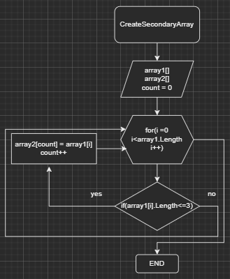

# Итоговый проект по результатам изучения программы I четверти курса "Разработчик" 

## Задание 1. Создать репозиторий на Github

### Решение:
[ссылка на репозиторий на GitHub](https://github.com/kaikillgerda/1st_final_project)


## Задание 2. Нарисовать блок-схему алгоритма (можно обойтись блок-схемой основной содержательной части, если вы выделяете ее в отдельный метод)

### Решение
находится в директории **BlockDiagram**:
 


## Задание 3. Снабдить репозиторий оформленным текстовым описанием решения

### Решение:
* Метод **CreateSecondaryArray** принимает на вход два заданных однмерных массива: *array1* и *arrray2*;
* Инициализируется счетчик *count* = 0;
* Решение реализовано перебором в цикле **for** и проверкой оператором **if** каждого элемента массива *array1* на соответствие условию задачи: длина i-го элемента меньше или равна трём символам: 
     * Если условие верно, значению элемента массива *array2* с индексом *count* присваетвается значение элемента массива *array1* с индексом *i*, увеличивается значение счетчика *count* на 1;
     * Если условие не выполняется, значение элементу массива *array2* не присваивается, значение счетчика *count* не увеличивается.

* Метод вывода массива **PrintArray** принимает на вход однмерный массив, убирает "пустые" (null) значения элементов массива и выводит на консоль полученный массив элементов. 

* Метод **Main** является основным телом программы.


## Задание 4. Написать программу, решающую поставленную задачу
### Решение
находится в директории **BlockDiagram**
```
void CreateSecondaryArray(string[] array1, string[] array2)
{
    int count = 0;
    for (int i = 0; i < array1.Length; i++)
    {
        if (array1[i].Length <= 3)
        {
            array2[count] = array1[i];
            count++;
        }
    }
}
